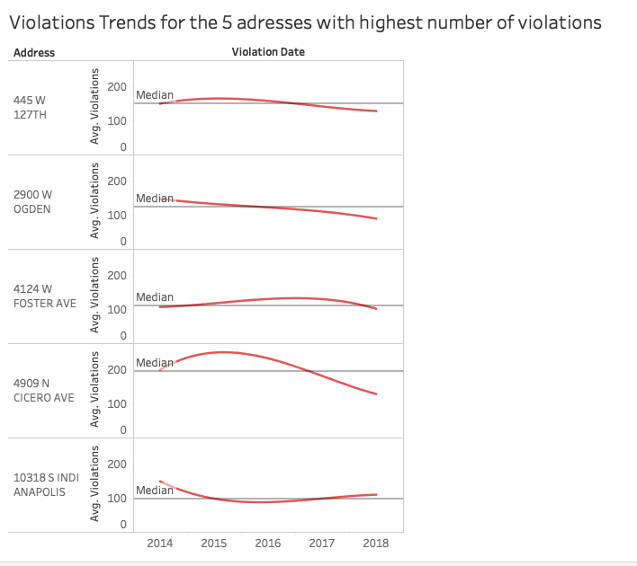
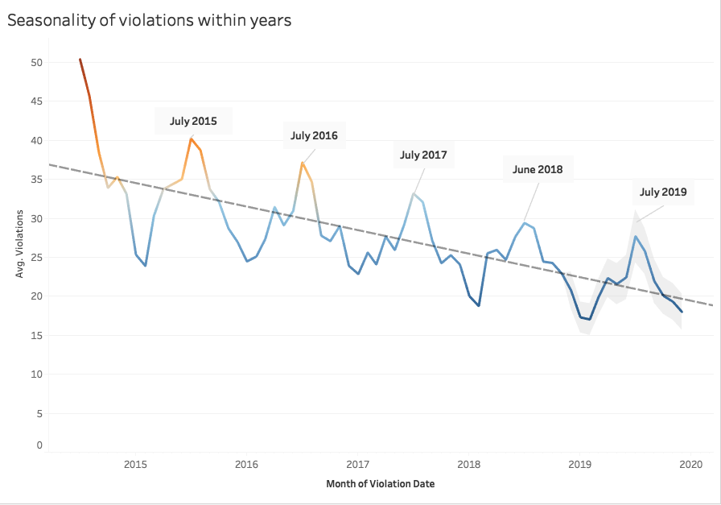
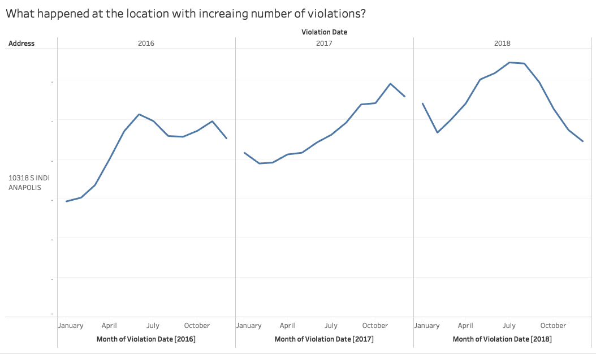

# Data Visualizations of Chicago's Automated Speed Enforcement Program
## The Documentation of visualizations for the Chicago's speed violation data from 2014-2019
[Tableau Public link for the visualizations](https://public.tableau.com/profile/yuhe.ren#!/vizhome/ChicagosSpeedEnforcementProgramAnalytics/Dashboard1)
>This dataset reflects the daily volume of violations that have occurred in Children's Safety Zones for each camera. The data reflects violations that occurred from July 1, 2014 until present, minus the most recent 14 days. This data may change due to occasional time lags between the capturing of a potential violation and the processing and determination of a violation. The most recent 14 days are not shown due to revised data being submitted to the City of Chicago. The reported violations are those that have been collected by the camera and radar system and reviewed by two separate City contractors. 
 [Data Scource]( https://data.cityofchicago.org/Transportation/Speed-Camera-Violations/hhkd-xvj4)

### 1. The violation trends for the 5 addresses with highest number of violations
 The first visualization shows the trend lines of average violations for the top 5 locations with highest number of violations since 2014.During the data exploration, I found that for these locations are outliers ,with the average number of violations occurred were much higher than the median. Therefore, this visualization illustrates the trend of violations for these locations to investigate the effectiveness of the speed enforcement program in Chicago.

 For the frist 4 locations, the trend of violations had been decreasing and dropped below median level after 2016. However, for the fifth location, there has been an increasing trend since 2016. It is important to further investigate the reason that violations at this locations started to increase in 2016, for the speed enforcement program to succeed as a whole.

### 2.Seasonality of violations within a year
 This visualization shows the seasonalyty pattern of violations happened over past years with the prediction line for next year. Previously during the data exploration, a sesonality pattern of the violation occurance that the peaks of violations happens in the summer of the year was revealed. Therefore, police resource can be allocated accordingly in order to increase the efficiency of the speed enforcement program. 

To further investigate the location in visualization 1 that has an increasing trend since 2016, it would be informative to compare the violations occurred in years for that location and the overall trend to detect abnormal occurance of violations.

### 3. Violation trend at the location with increasing number of violations
 This visualization shows the monthly average number of violations over years for the location from above where voilations have been increasing since 2016. Given the seasonality pattern that most of violations happens in the summer and less violations happens in the winter, there is an abnormal peak in November 2016 at this location that caused the total trend to increase from 2016. 

Investigations regarding this sudden increase in violations can be done and to prevent similar event to happen in the future.

