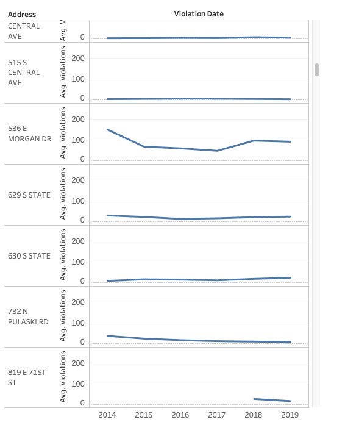
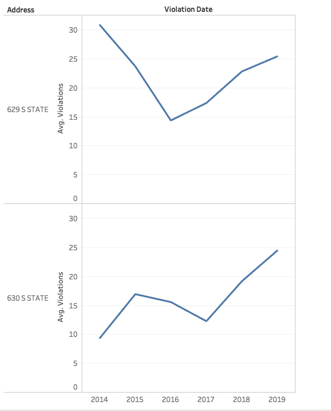
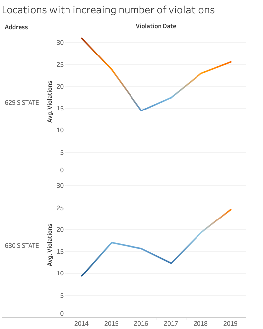

# Data Visualizations of Chicago's Automated Speed Enforcement Program
## The Documentation of visualizations for the Chicago's speed violation data from 2014-2019
[Tableau Public link for the visualizations](https://public.tableau.com/profile/yuhe.ren#!/vizhome/ChicagosSpeedEnforcementProgramAnalytics/Dashboard1)
### 1. The violation trends for the 5 addresses with highest number of violations
 The first visualization shows the trend lines of average violations for the top 5 locations with highest number of violations since 2014.During the data exploration, I found that for these locations are outliers ,with the average number of violations occurred were much higher than the median. Therefore, this visualization illustrates the trend of violations for these locations to investigate the effectiveness of the speed enforcement program in Chicago.

 For the frist 4 locations, the trend of violations had been decreasing and dropped below median level after 2016. However, for the fifth location, there has been an increasing trend since 2016. It is important to further investigate the reason that violations at this locations started to increase in 2016, for the speed enforcement program to succeed as a whole.

### 2.Seasonality of violations within a year
 

Finnally, since I would recommend to arrange more police force in months with more violations than others, it is informative to add lable for the month that has most violatoins. 
July is the month that has highest number of violations with a year.

### 3. Locations with increasing number of violations
 I have shown that there is an overall deceasing trend in violation over years and even for the locations with highest violations. However, there might be some locations that the number of violation is still increasing. If it is ture, there are definitely further investigation need to be made to discover the reason.
 In order to test my hypothesis, I plotted the over year trend for each location.

  Most of the locations have decreasing number of violations, but there are two locations that the number of violations are increasing.

 Then I visualized the change of violations at these two locations, and found for recent two years, the number of violations has increased drasticly, unlike at the rest of locations.
 I would suggest to further investigate the reason that the speed enforcement program are not performing well at these two locations, especially for recent two years.

