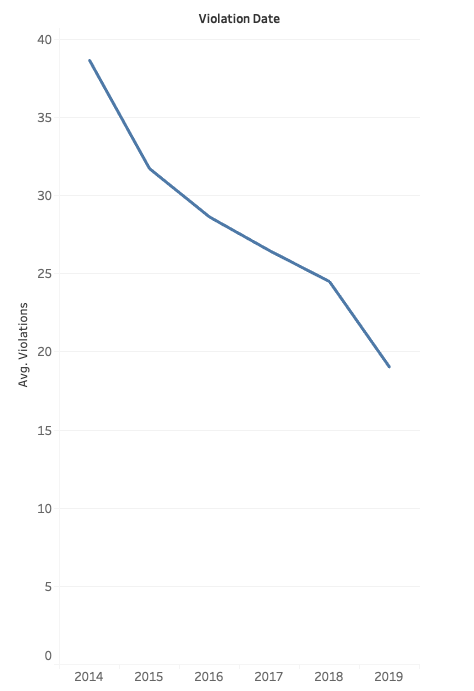

# Data Visualizations of Chicago's Automated Speed Enforcement Program
## The Making-of 3 visualizations for the Chicago's speed violation data from 2014-2019
[Tableau Public link for the 3 visualizations](https://public.tableau.com/profile/yuhe.ren#!/vizhome/FirstVersion_15565076106940/Sheet1?publish=yes)
### 1. The violation trends for the 5 addresses with highest number of violations
 I first started to explore the overall trend for violations, and found it to be deceasing.

 Then I wanted to know how violations are distributed across different addresses, and found that some locations have violations that way more than the rest.

 I am curious whether the speed enforcement program work for these locations, since they should be the focus of spped enforcement with the highest number of violations. Therefore I looked at the location with highest number of violations and found a decreasing trend.

 Then I filtered the top 5 locations of violations to see whether there is also a decreasing trend of violations through recent years.

 I found that at the top 5 locations of violations, the number of violations has been dramatically decreasing since 2018, so I added a line to compare the median number of violations to compare.

 Although the sum of violations for these locations are way above other locations, the number of violations have been decreasing for recent years and had dropped to average level.

### 2.Seasonality of violations within a year
 I have noticed that the aggregate number of violations has been decreasing over years, but still would like to explore what happens within a year. If seasonality exits, it can increase the efficiency of the speed enforcement program to arrange police force accordingly. 

 I plotted the monthly changes of violations over the past years, and found that most violations occured in summer, and much less in winter. It is likely that for the next years, this seasonality would still exit. I added a predition line to show this trend.

 It is likely that for the next years, this seasonality would still exit. I added a predition line to show this trend.

Finnally, since I would recommend to arrange more police force in months with more violations than others, it is informative to add lable for the month that has most violatoins. 
July is the month that has highest number of violations with a year.

### 3. Locations with increasing number of violations
 I have shown that there is an overall deceasing trend in violation over years and even for the locations with highest violations. However, there might be some locations that the number of violation is still increasing. If it is ture, there are definitely further investigation need to be made to discover the reason.
 In order to test my hypothesis, I plotted the over year trend for each location.

  Most of the locations have decreasing number of violations, but there are two locations that the number of violations are increasing.

 Then I visualized the change of violations at these two locations, and found for recent two years, the number of violations has increased drasticly, unlike at the rest of locations.
 I would suggest to further investigate the reason that the speed enforcement program are not performing well at these two locations, especially for recent two years.

